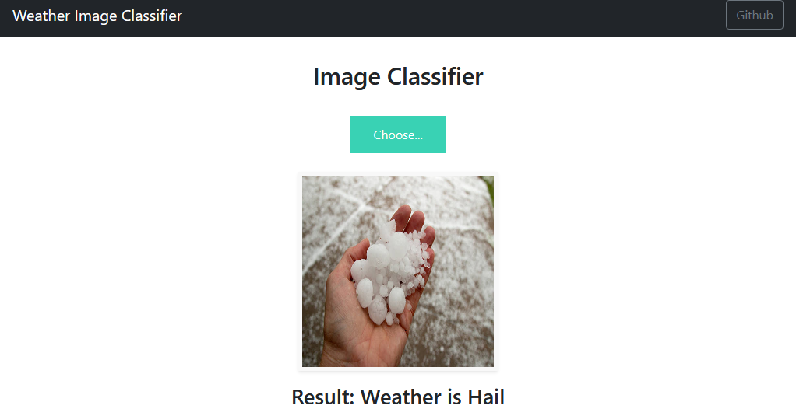
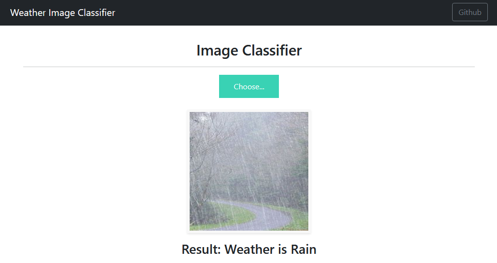
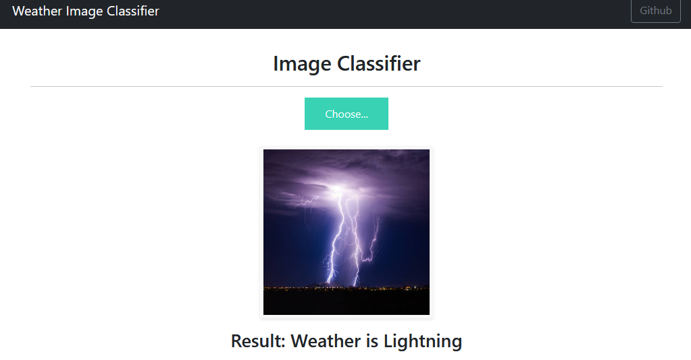
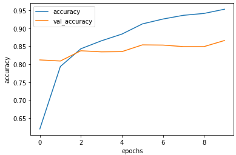
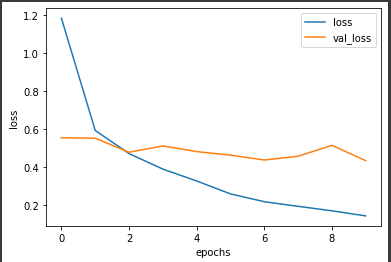

# Weather Image Classifier
Using custom State-of-the-Art MobileNetV2 model, this model classifies the uploaded image based on weather conditions present in the image and achieved 85% accuracy.
 
It classifies into following 11 categories
- 'snow'
- 'sandstorm',
- 'hail',
- 'frost',
- 'rain',
- 'fogsmog',
- 'lightning',
- 'rainbow',
- 'glaze',
- 'rime',
- 'dew'

Dataset is trained on 6877 images.

Dataset taken from :- https://doi.org/10.7910/DVN/M8JQCR%7D

Deployed at https://weatherimageclassifier.herokuapp.com/

Accuracy                  |  Loss
:-------------------------:|:-------------------------:
       | 

## Model summary

